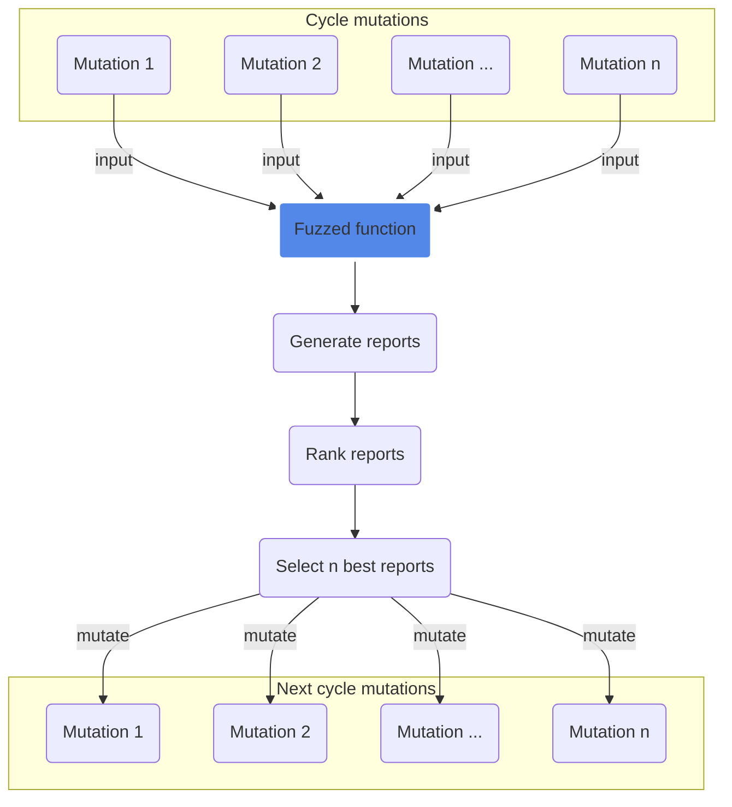

<p align=center>
  
  <br>
  <code>pip3 install frelatage</code></br>
  <i>Current release : <a href="https://github.com/Rog3rSm1th/Frelatage/releases">0.0.7</a></i></br></br>
  <a target="_blank" href="https://www.python.org/downloads/" title="Python version"></a>
  <a target="_blank" href="https://www.python.org/downloads/" title="Python version"></a>
  <a target="_blank" href="LICENSE" title="License: MIT"></a>
  <a target="_blank" title="Downloads"></a>
  <a target="_blank" href="https://twitter.com/Rog3rSm1th" title="Twitter"></a>
  <br>
  <span><i>The Python Fuzzer that the world deserves</i></span>
</p>

<p align="center">
  <a href="#installation">Installation</a>
  &nbsp;&nbsp;&nbsp;|&nbsp;&nbsp;&nbsp;
  <a href="#how-it-works">How it works</a>
  &nbsp;&nbsp;&nbsp;|&nbsp;&nbsp;&nbsp;
  <a href="#features">Features</a>
  &nbsp;&nbsp;&nbsp;|&nbsp;&nbsp;&nbsp;
  <a href="#use-frelatage">Use Frelatage</a>
  &nbsp;&nbsp;&nbsp;|&nbsp;&nbsp;&nbsp;
  <a href="#configuration">Configuration</a>
</p>

<p align="center">
  
</p>

Frelatage is a coverage-based Python fuzzing library which can be used to fuzz python code. The development of Frelatage was inspired by various other fuzzers, including [AFL](https://github.com/google/AFL)/[AFL++](https://github.com/AFLplusplus/AFLplusplus), [Atheris](https://github.com/google/atheris) and [PythonFuzz](https://github.com/fuzzitdev/pythonfuzz). The main purpose of the project is to take advantage of the best features of these fuzzers and gather them together into a new tool in order to efficiently fuzz python applications.

**DISCLAIMER** : This project is at the alpha stage and can still cause many unexpected behaviors. Frelatage should not be used in a production environment at this time.

## Requirements
[Python 3](https://www.python.org/)

## Installation

#### Install with pip (recommended)

```bash
pip3 install frelatage
```

#### Or build from source

Recommended for developers. It automatically clones the main branch from the frelatage repo, and installs from source.

```bash
# Automatically clone the Frelatage repository and install Frelatage from source
bash <(wget -q https://raw.githubusercontent.com/Rog3rSm1th/Frelatage/main/scripts/autoinstall.sh -O -)
```

## How it works

The idea behind the design of Frelatage is the usage of a genetic algorithm to generate mutations that will cover as much code as possible. The functioning of a fuzzing cycle can be roughly summarized with this diagram : 


## Features

#### Fuzzing different argument types: 
  - String
  - Int
  - Float
  - List
  - Tuple
  - Dictionary
  
#### File fuzzing
Frelatage allows to fuzz a function by passing a file as input. 

#### Fuzzer efficiency
- Corpus
- Dictionnary

## Use Frelatage

#### Fuzz a classical parameter

```python
import frelatage
import my_vulnerable_library

def MyFunctionFuzz(data):
  my_vulnerable_library.parse(data)

input = frelatage.Input(value="initial_value")
f = frelatage.Fuzzer(MyFunctionFuzz, [[input]])
f.fuzz()
```

#### Fuzz a file parameter

Frelatage gives you the possibility to fuzz file type input parameters. To initialize the value of these files, you must create files in the input folder (```./in``` by default).

If we want to initialize the value of a file used to fuzz, we can do it like this:
```bash
echo "initial value" > ./in/input.txt
```

And then run the fuzzer: 

```python
import frelatage
import my_vulnerable_library

def MyFunctionFuzz(data):
  my_vulnerable_library.load_file(data)

input = frelatage.Input(file=True, value="input.txt")
f = frelatage.Fuzzer(MyFunctionFuzz, [[input]])
f.fuzz()
```

#### Load several files to a corpus at once

If you need to load several files into a corpus at once (useful if you use a large corpus) You can use the built-in function of Frelatage `load_corpus`. This function returns a list of inputs.

```load_corpus(directory: str, file_extensions: list) -> list[Input]```
- directory: Subdirectory of the input directory (relative path), e.g `./`, `./images`
- file_extensions: List of file extensions to include in the corpus entries, e.g. `["jpeg", "gif"]`, `["pdf"]`

```python
import frelatage
import my_vulnerable_library

def MyFunctionFuzz(data):
  my_vulnerable_library.load_file(data)
  my_vulnerable_library.load_file(data2)

# Load every every file in the ./in directory
corpus_1 = frelatage.load_corpus(directory="./")
# Load every .gif/.jpeg file in the ./in/images subdirectory
corpus_2 = frelatage.load_corpus(directory="./images", file_extension=["gif", "jpeg"])

f = frelatage.Fuzzer(MyFunctionFuzz, [corpus_1, corpus_2])
f.fuzz()
```

#### Fuzz with a dictionary

You can copy one or more dictionaries located [here](https://github.com/Rog3rSm1th/Frelatage/tree/main/dictionaries) in the directory dedicated to dictionaries (`./dict` by default).

#### Differential fuzzing

[Differental fuzzing](https://en.wikipedia.org/wiki/Differential_testing) is a popular software testing technique that attempts to detect bugs by providing the same input to multiple libraries/programs and observing differences in their behaviors. You will find an example [here](https://github.com/Rog3rSm1th/Frelatage/blob/main/examples/json_fuzzer/json_differential_fuzzer.py) of a use of differential fuzzing with Frelatage with the `json` and `ujson` libraries. 

#### Examples

You can find more examples of fuzzers and corpus in the [examples directory](https://github.com/Rog3rSm1th/Frelatage/tree/main/examples).

- [Fuzzing Pillow with Frelatage to find bugs and vulnerabilities](https://rog3rsm1th.github.io/posts/fuzzing-python-libraries-frelatage/)

## Reports

Each crash is saved in the output folder (```./out``` by default), in a folder named : ```id:<crash ID>,err:<error type>,err_pos:<error>,err_file:<error file>```.

The report directory is in the following form: 
```
    ├── out
    │   ├── id:<crash ID>,err:<error type>,err_file:<error file>,err_pos:<err_pos>
    │       ├── input
    │       ├── 0
    │            ├── <inputfile1>
    │       ├── ...
    │   ├── ...
```

#### Read a crash report

Inputs passed to a function are serialized using the [pickle](https://docs.python.org/3/library/pickle.html) module before being saved in the ```<report_folder>/input file```. It is therefore necessary to deserialize it to be able to read the contents of the file. This action can be performed with [this script](https://github.com/Rog3rSm1th/Frelatage/blob/main/scripts/read_report.py). 

```bash
./read_report.py input
```
  
## Configuration

There are two ways to set up Frelatage:

#### Using the environment variables

| ENV Variable                   | Description | Possible Values | Default Value |
| -------------------------------| ----------- |--------|-------|
| **FRELATAGE_DICTIONARY_ENABLE**   | Enable the use of mutations based on dictionary elements| ```1``` to enable, ```0``` otherwise | ```1``` |
| **FRELATAGE_TIMEOUT_DELAY**        | Delay in seconds after which a function will return a TimeoutError | ```1``` - ```infinity``` | ```2``` |
| **FRELATAGE_INPUT_FILE_TMP_DIR**   | Temporary folder where input files are stored | absolute path to a folder, e.g. ```/tmp/custom_dir```| ```/tmp/frelatage```|
| **FRELATAGE_INPUT_MAX_LEN**        | Maximum size of an input variable in bytes | ```4``` - ```infinity``` |  ```4094``` |
| **FRELATAGE_MAX_THREADS**          | Maximum number of simultaneous threads | ```8``` - ```infinity``` | ```8``` |
| **FRELATAGE_MAX_CYCLES_WITHOUT_NEW_PATHS**      | Number of cycles without new paths found after which we go to the next stage | ```10``` - ```infinity``` | ```5000``` | 
| **FRELATAGE_INPUT_DIR**           | Directory containing the initial input files. It needs to be a relative path (to the path of the fuzzing file) |relative path to a folder, e.g. ```./in```  | ```./in``` |
| **FRELATAGE_DICTIONARY_DIR**      | Default directory for dictionaries. It needs to be a relative path (to the path of the fuzzing file) | relative path to a folder, e.g. ```./dict```  | ```./dict``` |  
| **FRELATAGE_DEBUG_MODE**      | Enable the debug mode (show the error when Frelatage crash) | ```1``` to enable, ```0``` otherwise | ```1``` | 

A configuration example :

```bash
export FRELATAGE_DICTIONARY_ENABLE=1 &&
export FRELATAGE_TIMEOUT_DELAY=2 &&
export FRELATAGE_INPUT_FILE_TMP_DIR="/tmp/frelatage" &&
export FRELATAGE_INPUT_MAX_LEN=4096 &&
export FRELATAGE_MAX_THREADS=8 &&
export FRELATAGE_MAX_CYCLES_WITHOUT_NEW_PATHS=5000 &&
export FRELATAGE_INPUT_DIR="./in" &&
export FRELATAGE_DICTIONARY_DIR="./dict" &&
python3 fuzzer.py
```

#### Passing arguments to the fuzzer 

```python
import frelatage 

def myfunction(input1_string, input2_int):
    pass

input1 = frelatage.Input(value="initial_value")
input2 = frelatage.Input(value=2)

f = frelatage.Fuzzer(
    # The method you want to fuzz
    method=myfunction,
    # Corpus
    corpus=[[input1], [input2]],
    # Number of threads
    threads_count=8,
    # Exceptions that will be taken into account
    exceptions_whitelist=(OSError),
    # Exceptions that will not be taken into account
    exceptions_blacklist=(),
    # Directory where the error reports will be stored
    output_directory="./out",
    # Enable or disable silent mode
    silent=False
)
f.fuzz()
```

## Risks 

Please keep in mind that, similarly to many other computationally-intensive
tasks, fuzzing may put strain on your hardware and on the OS. In particular:

  - Your CPU will run hot and will need adequate cooling. In most cases, if
    cooling is insufficient or stops working properly, CPU speeds will be
    automatically throttled. That said, especially when fuzzing on less
    suitable hardware (laptops, smartphones, etc), it's not entirely impossible
    for something to blow up.

  - Targeted programs may end up erratically grabbing gigabytes of memory or
    filling up disk space with junk files. Frelatage tries to enforce basic memory
    limits, but can't prevent each and every possible mishap. The bottom line
    is that you shouldn't be fuzzing on systems where the prospect of data loss
    is not an acceptable risk.

  - Fuzzing involves billions of reads and writes to the filesystem. On modern
    systems, this will be usually heavily cached, resulting in fairly modest
    "physical" I/O - but there are many factors that may alter this equation.
    It is your responsibility to monitor for potential trouble; with very heavy
    I/O, the lifespan of many HDDs and SSDs may be reduced.

    A good way to monitor disk I/O on Linux is the 'iostat' command:

```shell
    $ iostat -d 3 -x -k [...optional disk ID...]
```

## 🔴 About Me/Hire me 🖥️

I am Rog3rSm1th, I am 21 years old and I'm a French computer and cybersecurity enthusiast. I like developing tools (OSINT, Fuzzing...) and playing CTFs/Wargames. To learn more about me and my projects, juste click [here](https://github.com/Rog3rSm1th/Rog3rSm1th).

➜ If you want to hire me for one of your projects (Programming, cybersecurity...), just contact me at [r0g3r5@protonmail.com](mailto:r0g3r5@protonmail.com) and we will assess your needs together.

## Contact 

for any remark, suggestion, bug report, or if you found a bug using Frelatage, you can contact me at r0g3r5@protonmail.com or on twitter [@Rog3rSm1th](https://twitter.com/Rog3rSm1th)
